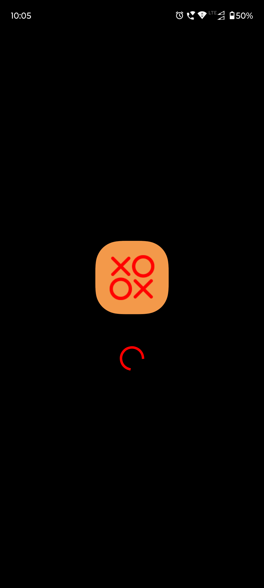
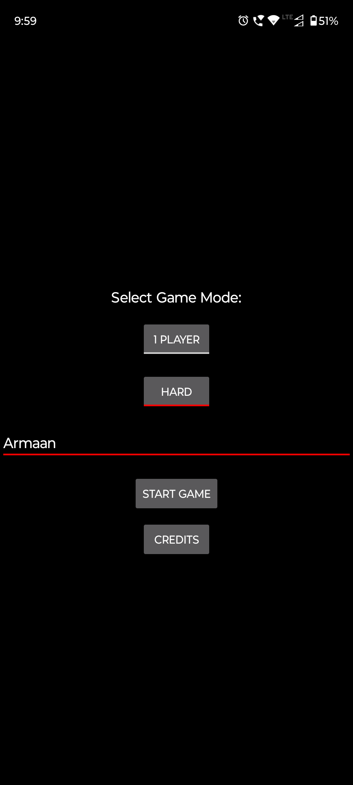
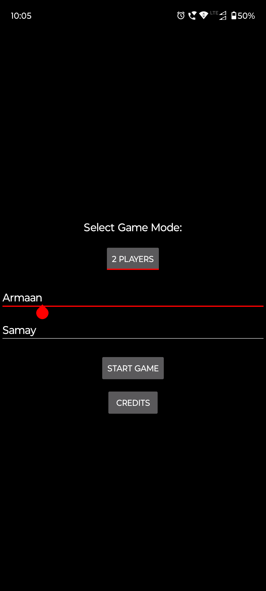
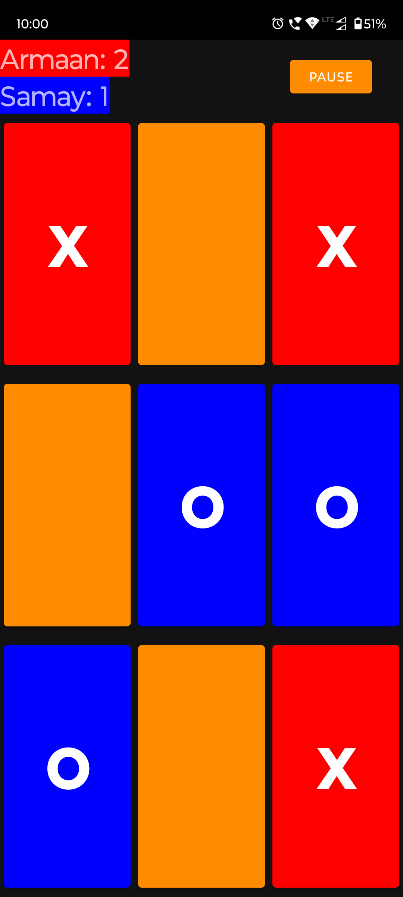
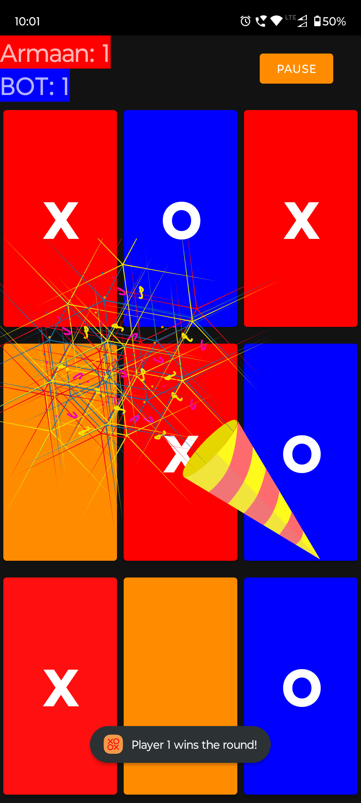
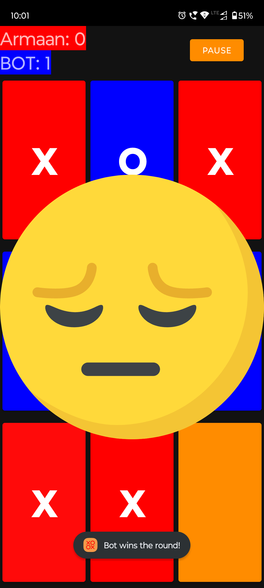
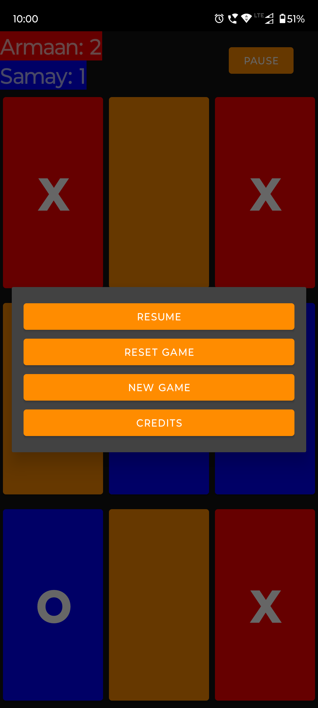
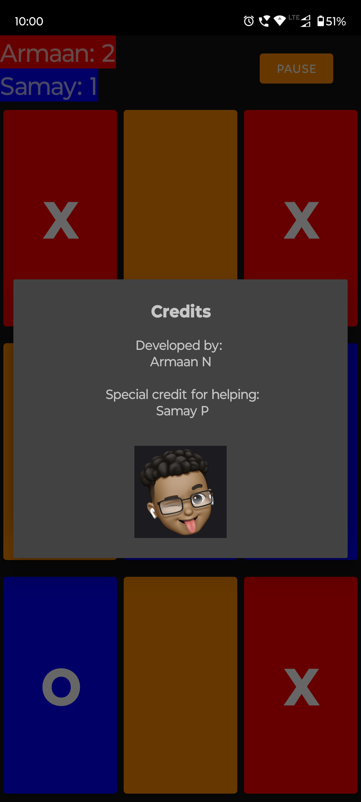

# Tic Tac Toe Android App

A modern implementation of the classic Tic Tac Toe game for Android devices, featuring both single-player and two-player gameplay modes.

Often referred to as Noughts and Crosses, is a timeless classic among board games. Its simplicity, yet potential for strategic depth, has made it a favorite pastime for people of all ages around the world. This game, played on a 3x3 grid, requires two players who take turns marking the grid with their respective symbols, typically "X" and "O." The objective is straightforward: be the first to complete a row, column, or diagonal with your symbols.

This repository is a version of the ![Noughts&Crosses] (https://github.com/Armaan4477/Noughts-and-Crosses) Game with lottie animations instead of pre-rendered animations which was a requirement for the project submission


## Features

- **Multiple Game Modes**: Play against another player or challenge the computer AI
- **Difficulty Levels**: Choose between easy and hard AI difficulty
- **Customizable Player Names**: Personalize your gaming experience
- **Score Tracking**: Keep track of wins for each player
- **Best-of-7 Format**: First player to reach 4 points wins the game
- **Beautiful Animations**: Victory and gameplay animations using Lottie
- **Pause Functionality**: Pause the game anytime and resume later
- **Modern UI Design**: Clean, intuitive interface

## Screenshots

<table>
  <tr>
    <td>
      
      <p align="center">Loading Screen</p>
    </td>
    <td>
      
      <p align="center">Single Player Setup</p>
    </td>
    <td>
      
      <p align="center">Two Player Setup</p>
    </td>
    <td>
      
      <p align="center">Gameplay</p>
    </td>
  </tr>
  <tr>
    <td>
      
      <p align="center">Player Win Animation</p>
    </td>
    <td>
      
      <p align="center">Bot Win Animation</p>
    </td>
    <td>
      
      <p align="center">Pause Menu</p>
    </td>
    <td>
      
      <p align="center">Credits Screen</p>
    </td>
  </tr>
</table>

## Technologies Used

- Java
- Android SDK
- Lottie Animation Library
- Android Architecture Components
- JUnit for testing

## Installation

### Requirements
- Android 12 (API level 31) or higher
- Approximately 20MB of free space

### Installation Options

#### Option 1: Download from Release
1. Go to the [Releases](https://github.com/Armaan4477/TicTacToe/releases) section
2. Download the latest APK file
3. On your Android device, allow installation from unknown sources in settings
4. Open the downloaded APK file to install

#### Option 2: Clone and Build
1. Clone the repository:
```
git clone https://github.com/Armaan4477/TicTacToe.git
```
2. Open the project in Android Studio
3. Build the project using Gradle
4. Run on an emulator or physical device

## How to Play

1. **Launch the App**: Open the app and wait for the loading screen
2. **Configure Game Settings**:
   - Choose between Single Player or Two Player mode
   - Enter player names
   - If playing Single Player, select difficulty level (Easy/Hard)
3. **Gameplay**:
   - Players take turns placing X and O on the 3×3 grid
   - Player 1 (X) always goes first
   - The first player to get 3 of their marks in a row (horizontally, vertically, or diagonally) wins the round
   - First player to win 4 rounds wins the game
4. **Controls**:
   - Tap on an empty cell to make your move
   - Use the pause button to access the pause menu
   - From the pause menu, you can resume, reset the game, start a new game, or view credits

## AI Difficulty Levels

- **Easy**: AI makes random moves and only blocks obvious winning moves
- **Hard**: AI strategically plays to win and always blocks your winning moves

## Development

### Project Structure
- `MainActivity.java`: Main game logic
- `GameOptionsActivity.java`: Game configuration screen
- `LoadingActivity.java`: Initial loading screen
- XML layouts in `res/layout/` directory
- Animations in `res/raw/` directory

### Build Configuration
- Built with Gradle
- Target SDK: 35
- Min SDK: 31 (Android 12)
- Version: 9.4

## Latest Release

Version 9.4 includes:
- Performance optimizations
- UI improvements
- Bug fixes for game logic
- Enhanced animations

Download the latest APK from the [Releases](https://github.com/Armaan4477/TicTacToe/releases) page.

## Credits

- Developed by: Armaan N
- Lottie Animations by Airbnb

## License

This project is licensed under the MIT License - see the LICENSE file for details.

## Contact

For questions, feedback, or issues, please [open an issue](https://github.com/Armaan4477/TicTacToe/issues) on GitHub.
